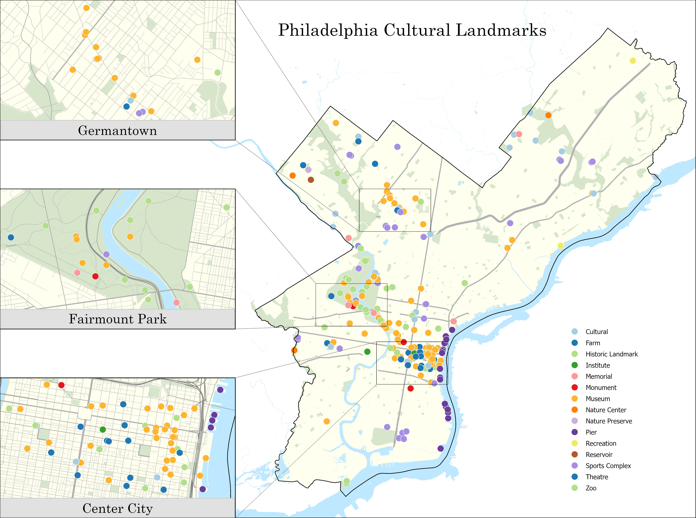
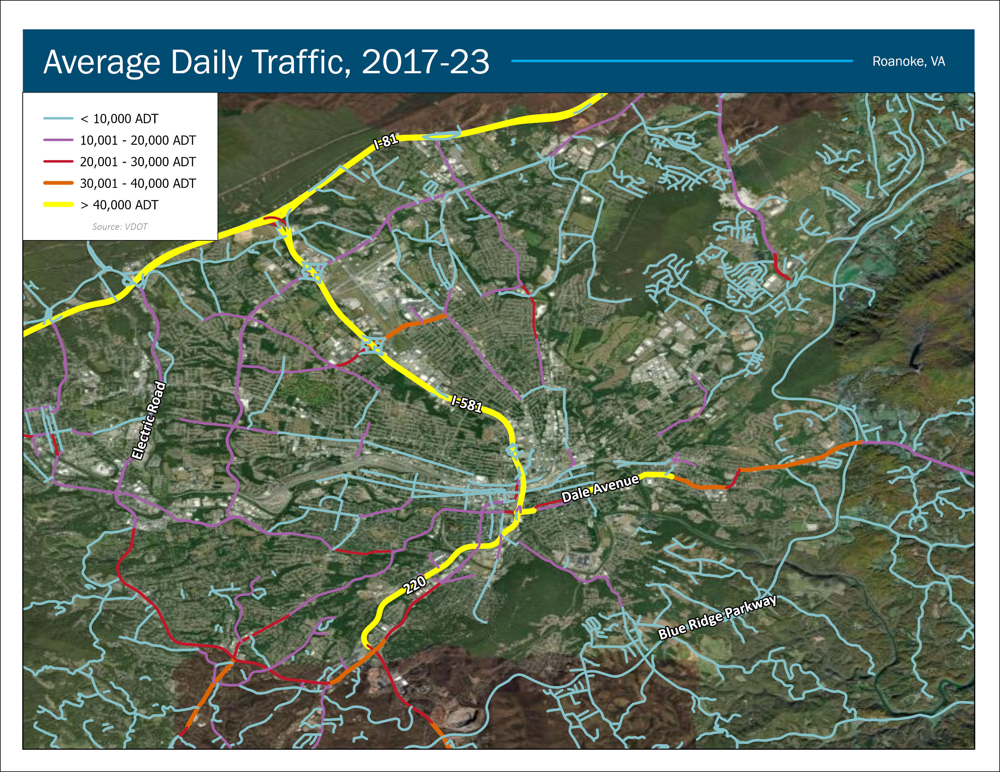
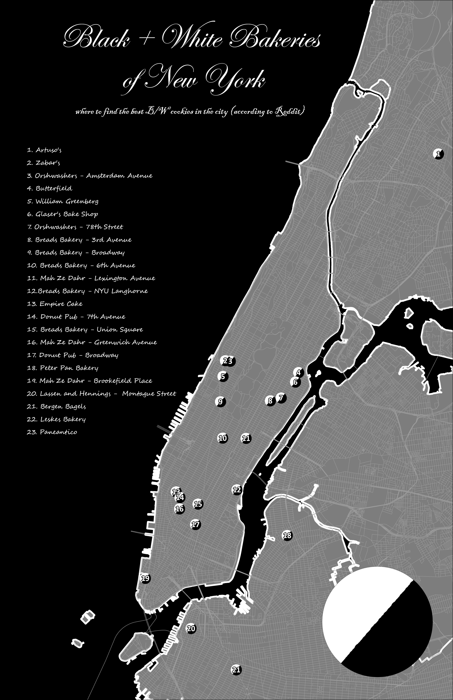

```{r setup, include=FALSE}
knitr::opts_chunk$set(echo = TRUE)
```


To celebrate this year's rendition of the 30 Day Mapping Challenge, I
have completed a selection of maps related to several topics. In the
maps detailed below, we explore Philadelphia's cultural heritage, travel
habits in Southwest Virginia, legacy bakeries in New York City, and
coffee shops in the Greater Philadelphia area.

## Author's Note

Many of these maps have been completed as part of a collaboration with
PHILADELPHIA250 and represent a chronological analysis completed
throughout the semester.

For further information about the Gateway analysis, please visit
<https://bit.ly/Phila26>.

# One: Points (PHL250)

### Philly's Identified Cultural Landmarks

To begin an analysis which ultimately led to the creation of the
potential Gateway areas for the 250th Celebration in 2026 (see Map
Three: Polygons), Danielle DiLeo Kim, the President of PHILADELPHIA250
and I sat down and thought of considerations we should include in 250th
related celebrations. The first thing that came out was an evaluation of
existing cultural identifications across the City, seen in the map
below. As suspected, many of the officially recognized landmarks are
found along Center City, Fairmount Park, and Germantown. Very few are
found in Northeast, West, and South Philly.



### Sources

**City Boundaries, Arterial Roads, Park Space, Water Features, Cultural
Landmarks, County Boundaries:** OpenDataPhilly

# Three: Polygons (PHL250)

### Mapping Philadelphia's Gateways

This map represents a culmination of analyses and conversations across
the entire semester. Each Gateway location may act as a point of
celebration for different communities across Philadelphia as 2026 kicks
off. Gateways may "activate" at different times of the year, in line
with preexisting Philadelphia favorites like the Manayunk Arts Festival
and ACANAFEST.


### Sources

**City Boundaries, Arterial Roads, Water Features, Park Space, County
Boundaries:** OpenDataPhilly

**Gateway Boundaries:** drawn by Danielle DiLeo Kim and myself,
digitized by me

# Five: Analog Map (PHL250)

### Sketches of the 250th Gateways

Bringing many of the analysis I completed with PHILADELPHIA250 together,
the following map represents the stitching together of many
conversations and new knowledge. We began by printing out a rebranded
cultural landmark map (see Map One: Points). The green dots represent
the physical marking of self-identified communities as part of PHL250's
Sunset Social event earlier in November (see Map 27: Dot), while the
other color dots represent areas of key interest from other PHL250
related projects. After evaluating the dot locations, Danielle DiLeo Kim
and I took markers and began tracing out potential gateway sites,
representing an ongoing conversation we are still having (see Map 3:
Polygons).


### Sources

**Street Centerlines, Water Features, City Boundaries, County
Boundaries, Park Space, and Cultural Landmarks:** OpenDataPhilly

**Potential Gateway Locations (Red Marker Lines):** marked by Danielle
DiLeo Kim and myself

**Green Dots:** Sunset Social Participants

**Color Dots:** PHL250 Studio Participants

# Seven: Navigation

### My Life on I-81, as Told by My Camera Roll

I wanted to take the opportunity to make a map that was little more
personal to me. When thinking of the navigating I've done over the last
few years, a majority of it was along I-81, the federal highway that
runs along much of the eastern US. While most trips were between Newark,
Delaware and Blacksburg, VA, lots of memories were formed at several of
the exit points, often leading me towards New York.


### Sources

**State Boundaries, Road Centerlines:** US TIGER Data

All points geocoded by me.

Photos by me.

# Thirteen: Choropleth (PHL250)

### Philadelphia's Foreign Born Population

When exploring potential Gateway sites with PHILADELPHIA250, it became
clear that many of the existing cultural landmarks (see Map One: Points)
are not found in areas with a strong Immigrant presence. To better
address these areas, I created the following map, which shows that
Oxford Circle, Northeast Philly, and Lower Moyamensing areas had the
strongest foreign born population.


### Sources

**Street Centerlines, City Boundaries, County Boundaries:**
OpenDataPhilly

**Foreign Born Population:** US Census

# Seventeen: Flow

### Traffic Volume for Roanoke, VA

When dealing with spatial analysis, flow can mean lots of things. When I
first heard the prompt, I was immediately reminded of traffic flow
counts. Easily accessible by a majority of municipal open data portals,
understanding traffic patterns for urban and suburban areas can tell a
lot to planners and those looking to develop the area further.

This map was inspired by the type of mapping I was trained in during my
time completing GIS work for a large real estate company. When working
with real estate brokers, they, like many other non-mapping people,
prioritized maps that got straight to the point with as little
distraction as possible. The company also prioritized mapping layouts
that are easily reproducible and flexible to a range of deliverables,
from being presented in a printed brochure to uploaded to a Powerpoint
slide. These maps were not the most eye-catching or artful, but they
were quick to the point and helped quickly pull market trends.



### Sources

**Traffic Data:** Virginia Department of Transportation (VDOT)

**Aerial Imagery:** ESRI

# Nineteen: A 5 Minute Map (PHL250)

### Philadelphia's Official Neighborhood Designations

When thinking about the 250th Gateways with PHILADELPHIA250, we wanted
to look at how Philadelphia's government officially categorizes the
City's neighborhoods, and compare it to how Philadelphian's actually
call it their own.


### Sources

**Philadelphia City Boundaries, Arterial Roads, Neighborhood
Boundaries:** OpenDataPhilly

# Twenty-Four: Black&White

### Where to find Black and White Cookies in NYC...

Legend has it that the famous double-coated shortbread cookie was
invented in the Big Apple. After scouring Reddit for the best bakeries
and cafe's that serve the treats, this is what I learned...

{width="483"}

{width="484"}



Author's Note: Here's a sample of the B/W cookie I'm eating while
editing this document!

{width="291"}

### Sources

**Borough Outlines, Road Centerlines:** NYC Data Portal

All points geocoded by me

# Twenty-Seven: Dot (PHL250)

### Sunset Social Results

The analyses I conducted with PHILADELPHIA250 included a public
engagement meeting that sought to create conversations about Philly's
cultural landmarks and community resources. After those in attendance
looked over the cultural landmark map we had created (see map 1:
Points), they were invited to place a green dot on the map of
Philadelphia on areas they felt greatest represented their community.
The map below shows the digitized results of these conversations, while
Map 5: Analog map, shows further analysis that continued after those
conversations.


### Sources

**City Boundaries, Arterial Roads, Park Space, and Water Features:**
OpenDataPhilly

All identified cultural assets were recorded by participating community
leaders, digitized by me.

# Thirty: My Favorite...

### Philadelphia Coffee Shops

I love a good study spot. I love chatting with friends. I love
supporting my local storefronts. And, what's better, I love a nice hot
cup of coffee to tie it all together. When I first moved to Philly, I
wanted to get to know Philly's coffee shop culture, ultimately striking
out on good resources on where to find my favorite type of "third
space."

I introduce to you - [The Philly Bean
Finder](https://upenn.maps.arcgis.com/apps/instant/basic/index.html?appid=947a00a320dd4048adba120c4d5ee7be) -
an online app hosted by AGOL that helps you track down those tucked away
cozy spots to meet up with friends or get some reading done. My research
began by taking to the streets - where are the coffee shops in my
neighborhood? After digging in a little more, the suspected patterns of
gentrification crept in - the majority of specialty coffee shops are in
the wealthiest, whitest areas of the city, those with the best access to
public transit.

{width="416"}

### Sources

All locations selected and geocoded by me
